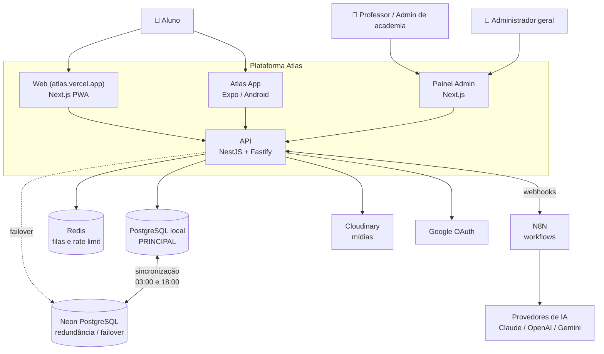
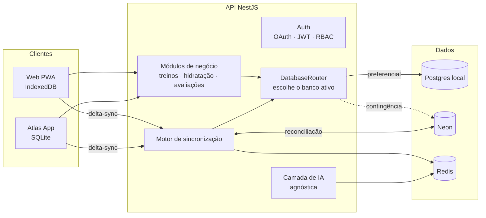
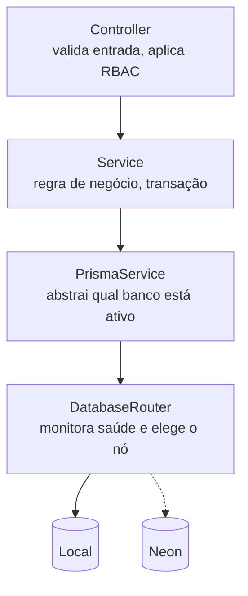
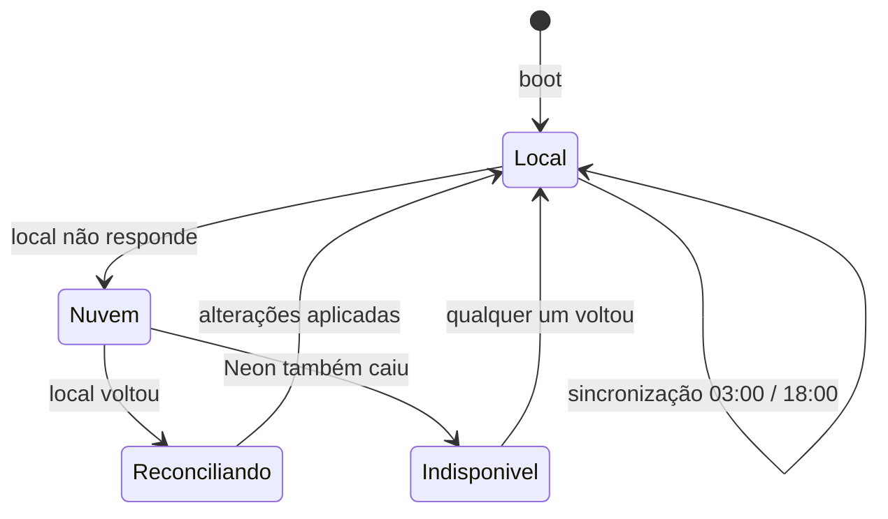
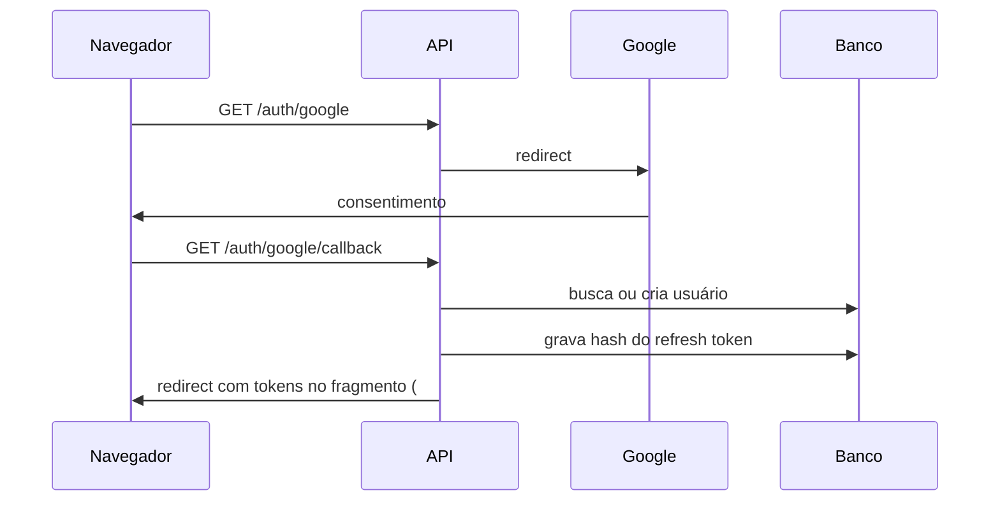
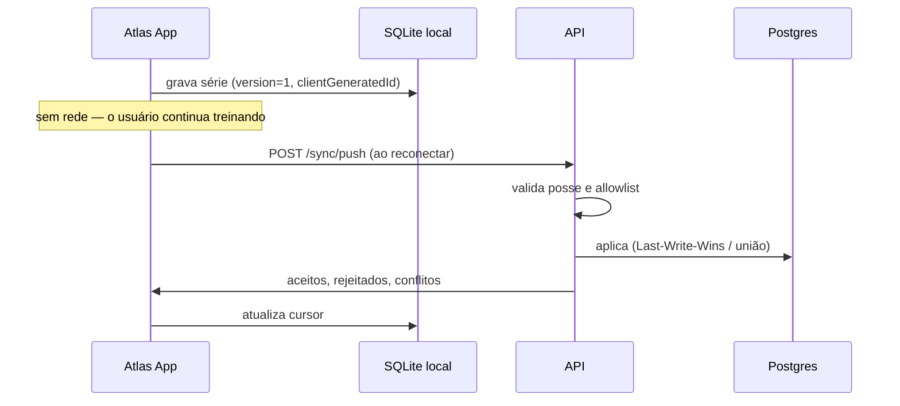

# Arquitetura do Atlas

## O problema que a arquitetura resolve

O Atlas é usado **dentro da academia**, onde o sinal costuma ser ruim. Se
o app depender de rede para registrar uma série, ele falha exatamente no
momento de uso. Daí decorrem as duas decisões que moldam todo o resto:

1. **O banco principal é local**, não na nuvem.
2. **O aplicativo é offline-first**: escreve no dispositivo e sincroniza depois.

Tudo o que segue existe para sustentar essas duas escolhas sem perder
consistência de dados.

---

## Contexto (C4 nível 1)



---

## Contêineres (C4 nível 2)



---

## Camadas dentro da API

Clean Architecture aplicada por feature (feature-first). Cada módulo tem
a mesma forma:

```
modules/<feature>/
  <feature>.controller.ts   apresentação — HTTP, validação, RBAC
  <feature>.service.ts      aplicação — casos de uso, transações
  <feature>.module.ts       composição — injeção de dependências
```

**A regra que sustenta o desacoplamento:** os serviços de negócio nunca
acessam `PrismaClient` diretamente — usam `PrismaService.db`, que devolve
o cliente do banco ativo. É por isso que o failover é invisível para eles.



---

## Estratégia de dados em duas camadas

### Camada A — failover de servidor (Local ↔ Neon)

Um verificador roda a cada 15 s. Enquanto o banco local responde, ele
atende tudo. Se parar de responder, o Neon assume; quando o local volta,
o sistema reconcilia automaticamente.



### Camada B — delta-sync dos dispositivos

O app escreve no banco do dispositivo e sincroniza com `push`/`pull`
usando um cursor por dispositivo. Detalhes em
[`offline-sync.md`](offline-sync.md).

---

## Por que essas tecnologias

| Escolha                  | Motivo                                                                                  | ADR                                           |
| ------------------------ | --------------------------------------------------------------------------------------- | --------------------------------------------- |
| Turborepo + pnpm         | Cache incremental; workspaces sem hoisting fantasma                                     | [001](adr/001-monorepo-turborepo.md)          |
| NestJS sobre Fastify     | Estrutura do Nest com o throughput do Fastify                                           | [002](adr/002-nestjs-sobre-fastify.md)        |
| Postgres local principal | O uso acontece onde a rede falha                                                        | [003](adr/003-banco-local-principal.md)       |
| Outbox (`ChangeLog`)     | Detecta exclusões e preserva ordem — varrer `updatedAt` não faz nem uma coisa nem outra | [004](adr/004-sincronizacao-outbox.md)        |
| Camada de IA isolada     | Trocar (ou remover) o provedor sem tocar no domínio                                     | [005](adr/005-camada-ia-desacoplada.md)       |
| Zod compartilhado        | Uma regra de validação, usada pela API e pelos formulários                              | [006](adr/006-validacao-zod-compartilhada.md) |

---

## Fluxos principais

### Login com Google



O token vai no **fragmento** (`#`), e não na query string: o fragmento
não é enviado ao servidor nem registrado em logs intermediários.

### Registro de treino offline



---

## Segurança

| Camada         | Mecanismo                                                     |
| -------------- | ------------------------------------------------------------- |
| Autenticação   | Google OAuth 2.0                                              |
| Sessão         | JWT de acesso (15 min) + refresh rotativo (30 dias)           |
| Roubo de token | Detecção de reuso → revoga a família do dispositivo           |
| Armazenamento  | Apenas o **hash** do refresh token é gravado                  |
| Autorização    | RBAC em dois níveis (papel + permissão) e escopo por academia |
| Abuso          | Rate limit por IP via Redis                                   |
| Webhooks       | HMAC-SHA256 com janela de 5 min contra replay                 |
| Auditoria      | `AuditLog` com estado antes/depois                            |

Detalhes em [`auth-security.md`](auth-security.md).

---

## Limites conhecidos desta fase

Registrados aqui para não parecerem esquecimento:

- **Front-end não implementado** — é o escopo da próxima fase.
- **Módulos de negócio parciais** — `users`, `hydration`, `exercises`,
  `workouts` (ciclo de execução), `assessments`, `sync`, `ai` e `home`
  estão funcionais; criação de planos por professor, administração de
  academias e catálogo estão marcados no [roadmap](roadmap.md).
- **Store on-device ausente** — o protocolo servidor está pronto e
  validado; SQLite/IndexedDB vêm junto com os apps.
- **Filas BullMQ configuradas, mas pouco usadas** — a sincronização usa
  o agendador do Nest; mover para fila fará sentido quando houver mais
  de uma instância da API.
