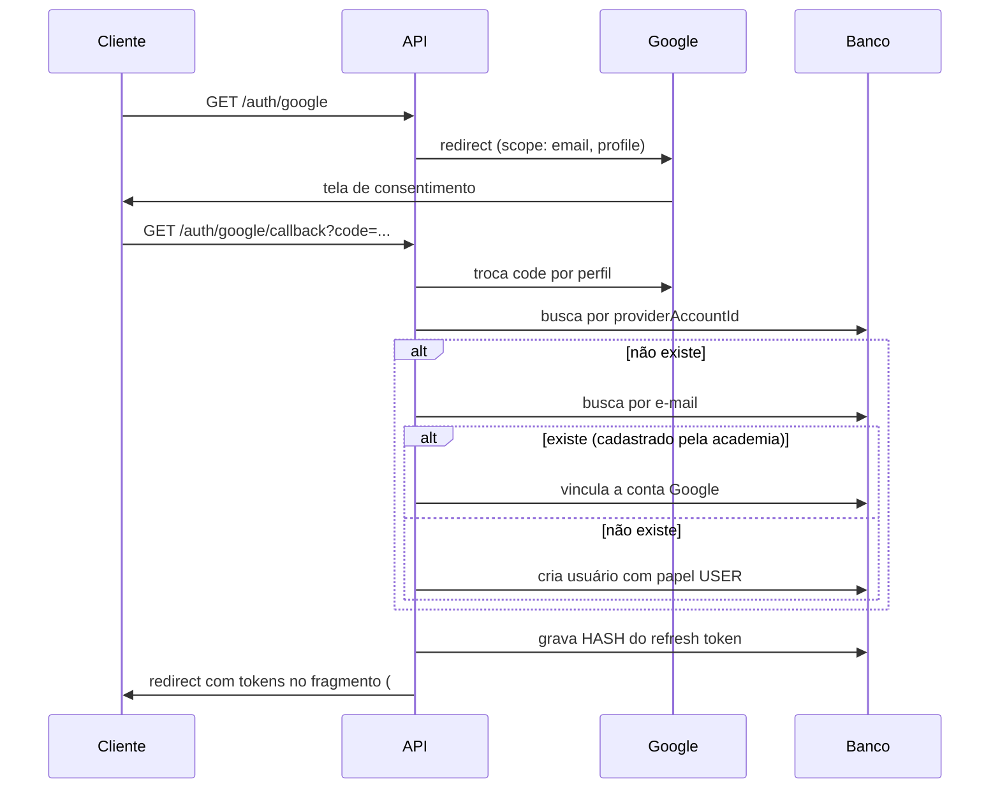
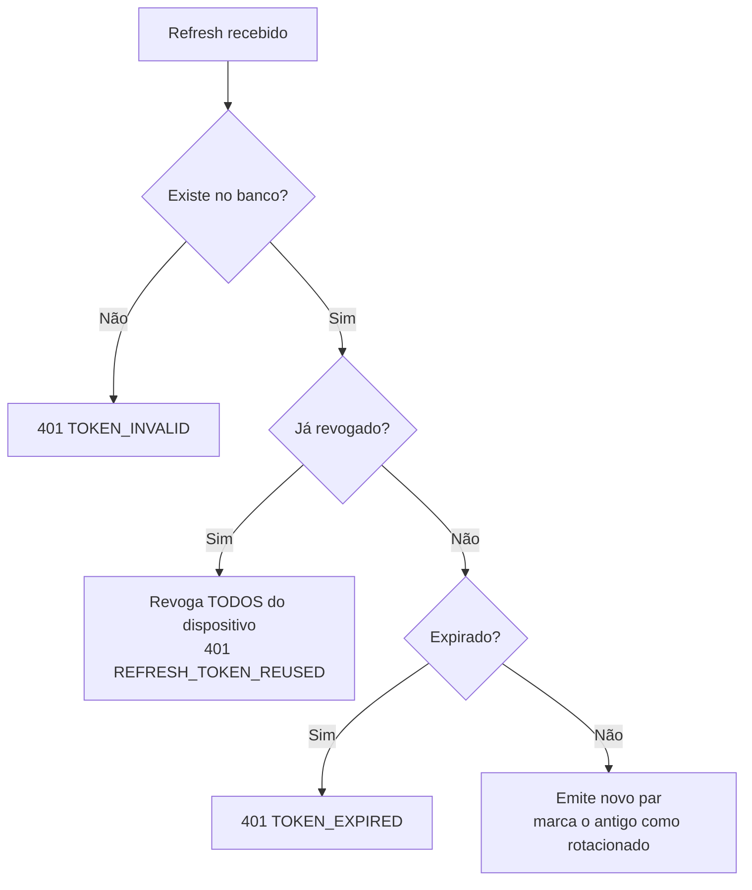

# Autenticação, Autorização e Segurança

---

## Fluxo de autenticação



O vínculo por e-mail existe para que um aluno pré-cadastrado pelo
administrador consiga entrar com o Google sem gerar cadastro duplicado.

---

## Tokens

|                    | Access                                                     | Refresh                      |
| ------------------ | ---------------------------------------------------------- | ---------------------------- |
| Validade           | 15 min                                                     | 30 dias                      |
| Estado no servidor | não                                                        | sim (hash em `RefreshToken`) |
| Conteúdo           | `sub`, `email`, `role`, `permissions`, `gymId`, `deviceId` | `sub`, `jti`, `deviceId`     |
| Revogável          | não (expira rápido)                                        | sim                          |

### Por que só o hash do refresh é gravado

Se o banco vazar, os tokens armazenados não são utilizáveis. SHA-256
basta aqui — diferente de senha, o token já é aleatório e de alta
entropia, portanto não é força-bruteável.

### Rotação e detecção de reuso

Cada uso do refresh emite um par novo e marca o anterior como
`revokedAt: rotated`.

Se um token **já rotacionado** for reapresentado, há duas possibilidades:
o token foi roubado, ou o cliente reenviou por falha de rede. O Atlas
trata como roubo — **revoga toda a família daquele dispositivo**.



O atacante e a vítima são desconectados juntos — e a vítima percebe o
problema, o que é preferível a um acesso silencioso e prolongado.

---

## Autorização (RBAC)

Dois níveis complementares:

```
Papel      → alcance geral   (USER, PROFESSOR, GYM_ADMIN, SUPER_ADMIN)
Permissão  → ação exata      (workout:create, gym:block, sync:trigger…)
```

Os guards checam permissão; o papel entra nas regras de escopo.

### Guards globais

```ts
{ provide: APP_GUARD, useClass: ThrottlerGuard }  // rate limit
{ provide: APP_GUARD, useClass: JwtAuthGuard }    // autenticação
{ provide: APP_GUARD, useClass: RbacGuard }       // autorização
```

**A proteção é o padrão; abrir uma rota exige `@Public()`.** A inversão é
deliberada: esquecer de proteger uma rota nova seria uma falha silenciosa
de segurança, enquanto esquecer de liberar uma rota pública aparece no
primeiro teste.

### Escopo por academia

```ts
canAccessGym(subject, gymId); // SUPER_ADMIN atravessa; demais, só a própria
canAccessUserData(subject, target); // o próprio + staff da MESMA academia
```

Staff sem academia definida não tem escopo sobre ninguém — sem essa
verificação, um professor sem vínculo enxergaria todos os alunos.

### Matriz resumida

| Ação                     | USER |   PROFESSOR    |   GYM_ADMIN    | SUPER_ADMIN |
| ------------------------ | :--: | :------------: | :------------: | :---------: |
| Registrar treino         |  ✅  |       ✅       |       ✅       |     ✅      |
| Criar treino             |  —   |       ✅       |       ✅       |     ✅      |
| Ver dados de outro aluno |  —   | mesma academia | mesma academia |     ✅      |
| Gerenciar usuários       |  —   |       —        |       ✅       |     ✅      |
| Bloquear academia        |  —   |       —        |       —        |     ✅      |
| Editar catálogo global   |  —   |       —        |       —        |     ✅      |
| Disparar sincronização   |  —   |       —        |       —        |     ✅      |

Fonte da verdade: `ROLE_PERMISSIONS` em `@atlas/shared`. É a mesma
constante usada no seed do banco e na UI.

---

## Proteção da camada de sincronização

O payload de `/sync/push` vem de um cliente offline e **não é confiável**.
Duas validações obrigatórias:

1. **Allowlist de entidades** — sem ela, um cliente poderia enviar
   alterações para qualquer tabela, inclusive `Role` e `Permission`,
   escalando privilégio.
2. **Verificação de posse** — todo registro com dono precisa pertencer ao
   usuário do token. Sem isso, bastaria trocar o `userId` no payload para
   alterar dados de outra pessoa.

O servidor também descarta `id`, `version` e `originNode` vindos no corpo:
quem define esses campos é o servidor.

---

## Webhooks

O n8n devolve resultados por webhook. Sem autenticação, qualquer um que
alcançasse a API poderia injetar um "relatório semanal" falso.

Formato do header `x-atlas-signature`:

```
t=<timestamp_ms>,v1=<hmac_sha256_hex>
```

O HMAC é calculado sobre `<timestamp>.<corpo>` com `N8N_WEBHOOK_SECRET`.

Proteções:

- **Janela de 5 minutos** contra replay de uma requisição capturada.
- **Comparação em tempo constante** (`timingSafeEqual`) — comparação
  comum vazaria o segredo por diferença de tempo.

---

## Outras camadas

| Camada          | Implementação                                                        |
| --------------- | -------------------------------------------------------------------- |
| Cabeçalhos HTTP | `@fastify/helmet`                                                    |
| CORS            | Allowlist explícita (`CORS_ORIGINS`)                                 |
| Rate limit      | 120 req/min por IP, via Redis                                        |
| Logs            | `authorization`, `cookie`, `refreshToken` e `password` são redigidos |
| Erros           | Detalhes internos nunca vão ao cliente                               |
| Auditoria       | `AuditLog` com estado antes/depois                                   |
| Senha (futuro)  | `bcryptjs` custo 12                                                  |

### Por que bcryptjs e não argon2id

`argon2id` é preferível criptograficamente, mas exige compilação nativa
que trava a instalação no Windows com frequência. Como o login por senha
ainda **não está habilitado** (o MVP usa apenas Google OAuth), optamos
pela portabilidade e registramos a troca no roadmap para quando o login
por e-mail entrar.

---

## Checklist antes de ir a produção

- [ ] `JWT_ACCESS_SECRET` e `JWT_REFRESH_SECRET` reais
      (`node -e "console.log(require('crypto').randomBytes(48).toString('base64'))"`)
- [ ] `N8N_WEBHOOK_SECRET` real
- [ ] `CORS_ORIGINS` sem `localhost`
- [ ] `DATABASE_URL_CLOUD` configurado (o schema de ambiente exige em produção)
- [ ] Redirect URIs do Google apontando para o domínio real
- [ ] `NODE_ENV=production`
- [ ] Senhas padrão do Docker trocadas
- [ ] Postgres não exposto na internet
- [ ] Backup testado — **restauração**, não só geração
