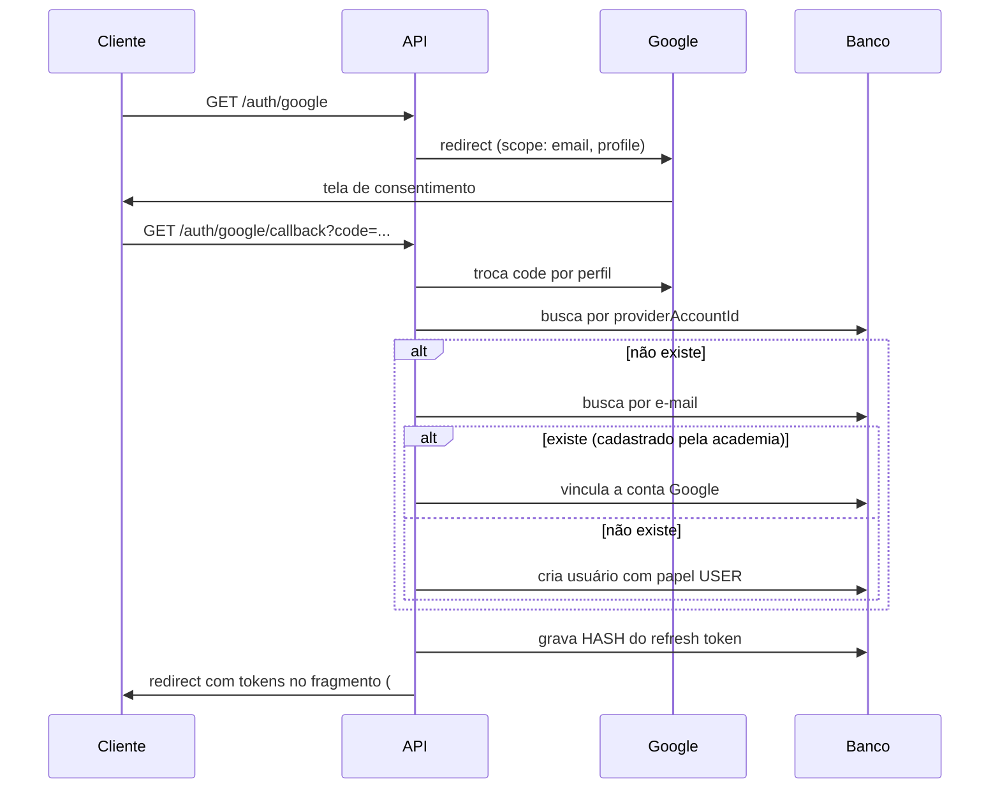
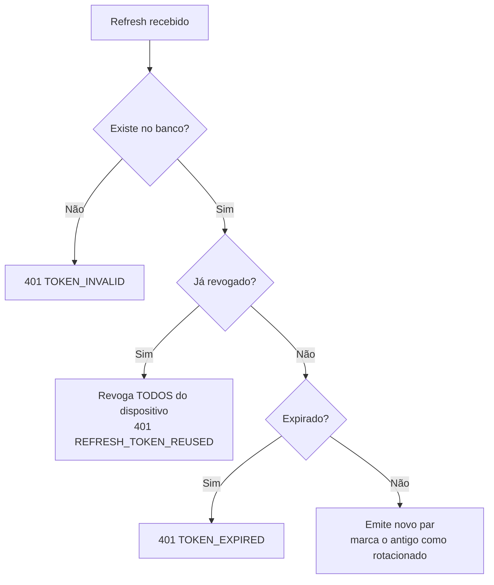

# Autenticação, Autorização e Segurança

---

## Métodos de login

O Atlas aceita dois caminhos para a mesma conta:

| Método           | Rota               | Estado                                    |
| ---------------- | ------------------ | ----------------------------------------- |
| **Credenciais**  | `POST /auth/login` | ativo                                     |
| **Google OAuth** | `GET /auth/google` | pronto; ativa ao preencher as credenciais |

`GET /auth/providers` diz ao cliente o que está disponível — a tela de
login monta os botões a partir dessa resposta, e ligar o Google depois
não exige mexer no front.

### Campo único de identificador

`POST /auth/login` recebe `{ identifier, password }`. O `identifier`
aceita **e-mail, CPF ou telefone**, e a API descobre qual é
(`resolveLoginIdentifier`, em `@atlas/shared`).

Um campo só, e não três abas: o usuário não lembra com o que se
cadastrou, e obrigá-lo a escolher a aba certa é transformar uma
lembrança em um erro de login.

### Forma canônica — por que a normalização não é cosmética

CPF vai ao banco com 11 dígitos, sem pontuação. Telefone vai em E.164
(`+55DDNNNNNNNNN`). A conversão acontece no schema Zod, antes de
qualquer consulta.

Sem isso, `529.982.247-25` e `52998224725` seriam **duas contas**: a
constraint de unicidade compara strings, e as duas são diferentes. O
usuário criaria a segunda sem perceber e perderia o histórico da
primeira.

Onze dígitos podem ser CPF **ou** celular com DDD. Quando os dois
formatos são plausíveis, a consulta procura por ambos
(`candidateIdentifiers`) — o usuário não precisa saber que existe
ambiguidade.

### O que a resposta de erro não conta

| Situação                            | Resposta                                |
| ----------------------------------- | --------------------------------------- |
| Senha errada                        | 401 `INVALID_CREDENTIALS`               |
| Conta inexistente                   | 401 `INVALID_CREDENTIALS` — **o mesmo** |
| Conta inativa                       | 403 `USER_INACTIVE`                     |
| Conta sem senha (entrou por Google) | 409 `PASSWORD_NOT_SET`                  |
| Conta nunca ativada                 | 409 `FIRST_ACCESS_REQUIRED`             |

Os dois primeiros são deliberadamente idênticos, e o bcrypt roda **mesmo
quando o usuário não existe** (contra um hash descartável). Uma resposta
diferente — ou um tempo de resposta diferente — entregaria a um atacante
a lista de quem tem conta no Atlas.

`PASSWORD_NOT_SET` é a exceção justificada: sem ele, quem entrou por
Google ficaria tentando senhas que nunca existiram.

> O `dev-login` foi **removido**. Ele emitia sessão de SUPER_ADMIN sem
> senha alguma. Não recrie a rota: para acesso local, use o admin do
> seed e o fluxo de primeiro acesso abaixo.

---

## Primeiro acesso

Contas criadas pela academia (ou pelo seed) nascem **sem senha**. Quem
abre o app pela primeira vez se identifica, prova a posse com um
**código de ativação** e escolhe a própria senha.

```
POST /auth/login          → 409 FIRST_ACCESS_REQUIRED
POST /auth/first-access   { identifier, activationCode, newPassword }
                          → 200 com a sessão já emitida
```

### Por que existe um código, se o usuário já sabe o CPF

Porque **CPF não é segredo**. Ele circula em vazamento, boleto, cadastro
de farmácia e ficha de academia. Se bastasse o CPF para definir a senha,
qualquer pessoa com uma lista de CPFs tomaria as contas — inclusive a do
`SUPER_ADMIN`, que é a mais valiosa do sistema.

O código resolve isso sem depender de e-mail ou SMS (que o Atlas ainda
não tem): ele é entregue **fora do app** — impresso, dito no balcão,
mandado por mensagem.

| Propriedade | Valor                                                |
| ----------- | ---------------------------------------------------- |
| Formato     | 8 caracteres, alfabeto de 32 (~40 bits)              |
| Alfabeto    | sem `O`, `0`, `I`, `1`, `L` — sobrevive a ser ditado |
| Armazenagem | SHA-256; o valor em claro aparece uma única vez      |
| Comparação  | tempo constante (`timingSafeEqual`)                  |
| Validade    | 7 dias                                               |
| Reuso       | nenhum — some quando a senha é criada                |

Combinado com o limite de 10 tentativas/min nas rotas de auth, varrer o
espaço de códigos é inviável.

### O que a resposta não conta

Identificador desconhecido, código errado, código expirado e conta que
já tem senha devolvem **exatamente o mesmo** `ACTIVATION_CODE_INVALID`,
com a mesma mensagem. Diferenciar diria ao atacante em qual das quatro
condições ele acertou.

> **Limitação conhecida:** `FIRST_ACCESS_REQUIRED` no login revela que
> existe conta para aquele identificador. É o mesmo compromisso já
> aceito em `PASSWORD_NOT_SET`: sem esse sinal, a pessoa fica presa numa
> tela de senha que nunca vai funcionar. Quando houver e-mail/SMS, o
> caminho melhor é enviar o código pelo canal verificado e responder
> sempre "se a conta existir, enviamos o código".

---

## Fluxo do Google OAuth



O vínculo por e-mail existe para que um aluno pré-cadastrado pelo
administrador consiga entrar com o Google sem gerar cadastro duplicado.

---

## Tokens

|                    | Access                                                     | Refresh                      |
| ------------------ | ---------------------------------------------------------- | ---------------------------- |
| Validade           | 15 min                                                     | 30 dias                      |
| Estado no servidor | não                                                        | sim (hash em `RefreshToken`) |
| Conteúdo           | `sub`, `email`, `role`, `permissions`, `gymId`, `deviceId` | `sub`, `jti`, `deviceId`     |
| Revogável          | não (expira rápido)                                        | sim                          |

### Por que só o hash do refresh é gravado

Se o banco vazar, os tokens armazenados não são utilizáveis. SHA-256
basta aqui — diferente de senha, o token já é aleatório e de alta
entropia, portanto não é força-bruteável.

### Rotação e detecção de reuso

Cada uso do refresh emite um par novo e marca o anterior como
`revokedAt: rotated`.

Se um token **já rotacionado** for reapresentado, há duas possibilidades:
o token foi roubado, ou o cliente reenviou por falha de rede. O Atlas
trata como roubo — **revoga toda a família daquele dispositivo**.



O atacante e a vítima são desconectados juntos — e a vítima percebe o
problema, o que é preferível a um acesso silencioso e prolongado.

---

## Autorização (RBAC)

Dois níveis complementares:

```
Papel      → alcance geral   (USER, PROFESSOR, GYM_ADMIN, SUPER_ADMIN)
Permissão  → ação exata      (workout:create, gym:block, sync:trigger…)
```

Os guards checam permissão; o papel entra nas regras de escopo.

### Guards globais

```ts
{ provide: APP_GUARD, useClass: ThrottlerGuard }  // rate limit
{ provide: APP_GUARD, useClass: JwtAuthGuard }    // autenticação
{ provide: APP_GUARD, useClass: RbacGuard }       // autorização
```

**A proteção é o padrão; abrir uma rota exige `@Public()`.** A inversão é
deliberada: esquecer de proteger uma rota nova seria uma falha silenciosa
de segurança, enquanto esquecer de liberar uma rota pública aparece no
primeiro teste.

### Escopo por academia

```ts
canAccessGym(subject, gymId); // SUPER_ADMIN atravessa; demais, só a própria
canAccessUserData(subject, target); // o próprio + staff da MESMA academia
```

Staff sem academia definida não tem escopo sobre ninguém — sem essa
verificação, um professor sem vínculo enxergaria todos os alunos.

### Matriz resumida

| Ação                     | USER |   PROFESSOR    |   GYM_ADMIN    | SUPER_ADMIN |
| ------------------------ | :--: | :------------: | :------------: | :---------: |
| Registrar treino         |  ✅  |       ✅       |       ✅       |     ✅      |
| Criar treino             |  —   |       ✅       |       ✅       |     ✅      |
| Ver dados de outro aluno |  —   | mesma academia | mesma academia |     ✅      |
| Gerenciar usuários       |  —   |       —        |       ✅       |     ✅      |
| Bloquear academia        |  —   |       —        |       —        |     ✅      |
| Editar catálogo global   |  —   |       —        |       —        |     ✅      |
| Disparar sincronização   |  —   |       —        |       —        |     ✅      |

Fonte da verdade: `ROLE_PERMISSIONS` em `@atlas/shared`. É a mesma
constante usada no seed do banco e na UI.

---

## Proteção da camada de sincronização

O payload de `/sync/push` vem de um cliente offline e **não é confiável**.
Duas validações obrigatórias:

1. **Allowlist de entidades** — sem ela, um cliente poderia enviar
   alterações para qualquer tabela, inclusive `Role` e `Permission`,
   escalando privilégio.
2. **Verificação de posse** — todo registro com dono precisa pertencer ao
   usuário do token. Sem isso, bastaria trocar o `userId` no payload para
   alterar dados de outra pessoa.

O servidor também descarta `id`, `version` e `originNode` vindos no corpo:
quem define esses campos é o servidor.

---

## Webhooks

O n8n devolve resultados por webhook. Sem autenticação, qualquer um que
alcançasse a API poderia injetar um "relatório semanal" falso.

Formato do header `x-atlas-signature`:

```
t=<timestamp_ms>,v1=<hmac_sha256_hex>
```

O HMAC é calculado sobre `<timestamp>.<corpo>` com `N8N_WEBHOOK_SECRET`.

Proteções:

- **Janela de 5 minutos** contra replay de uma requisição capturada.
- **Comparação em tempo constante** (`timingSafeEqual`) — comparação
  comum vazaria o segredo por diferença de tempo.

---

## Outras camadas

| Camada          | Implementação                                                         |
| --------------- | --------------------------------------------------------------------- |
| Cabeçalhos HTTP | `@fastify/helmet`                                                     |
| CORS            | Allowlist explícita (`CORS_ORIGINS`)                                  |
| Rate limit      | Por família de rota, contador **compartilhado no Redis** (ver abaixo) |
| Logs            | `authorization`, `cookie`, `refreshToken` e senhas são redigidos      |
| Erros           | Detalhes internos nunca vão ao cliente                                |
| Auditoria       | `AuditLog` com estado antes/depois                                    |
| Senha           | `bcryptjs` custo 12, com rehash oportunista no login                  |

### Rate limit

| Família | Limite    | Rotas                              |
| ------- | --------- | ---------------------------------- |
| `auth`  | 10 / min  | register, login, password, refresh |
| `sync`  | 10 / min  | push, pull, trigger                |
| `ai`    | 5 / hora  | reports/generate                   |
| padrão  | 120 / min | todo o resto                       |

O contador fica no **Redis**, não na memória do processo: com duas
instâncias da API, um contador local dobraria o limite efetivo, e todo
restart zeraria a contagem — bastaria esperar um deploy.

A contagem é **por usuário** quando há access token válido, e por IP
quando não há. Numa academia inteira atrás do mesmo NAT, contar por IP
faria o primeiro usuário consumir a cota de todos.

Quando o Redis está fora, o limite degrada para contagem em memória com
um WARN. Recusar tudo transformaria uma queda do Redis em queda do
Atlas.

> Ao adicionar uma família nova, passe por `buildThrottlers` e
> `@ThrottleFamily`. Todo throttler declarado no módulo do
> `@nestjs/throttler` é avaliado em **toda** rota; sem o `skipIf` que
> isola as famílias, um limite de 5/hora derruba a API inteira.

### Por que bcryptjs e não argon2id

`argon2id` é preferível criptograficamente, mas exige compilação nativa
que trava a instalação no Windows com frequência. Optamos pela
portabilidade; o custo 12 dá margem adequada, e o `needsRehash` no login
migra as senhas sozinho quando o custo subir. A troca está registrada no
roadmap.

---

## Checklist antes de ir a produção

- [ ] `JWT_ACCESS_SECRET` e `JWT_REFRESH_SECRET` reais
      (`node -e "console.log(require('crypto').randomBytes(48).toString('base64'))"`)
- [ ] `N8N_WEBHOOK_SECRET` real
- [ ] `CORS_ORIGINS` sem `localhost`
- [ ] `DATABASE_URL_CLOUD` configurado (o schema de ambiente exige em produção)
- [ ] Redirect URIs do Google apontando para o domínio real
- [ ] `NODE_ENV=production`
- [ ] Senhas padrão do Docker trocadas
- [ ] Postgres não exposto na internet
- [ ] Backup testado — **restauração**, não só geração
