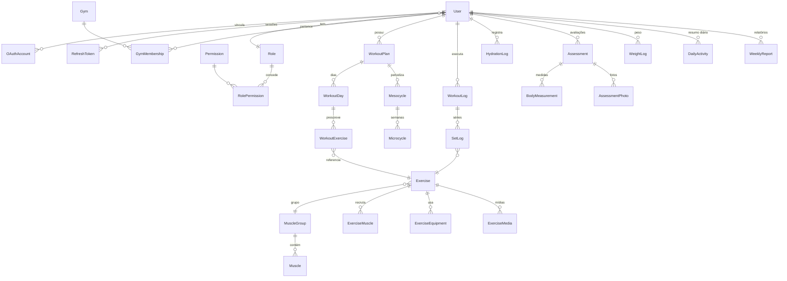

# Modelo de Dados

Schema completo: [`packages/database/prisma/schema.prisma`](../packages/database/prisma/schema.prisma)

---

## Padrão de sincronização

Todo modelo sincronizável carrega:

```prisma
version    Int       @default(1)   // incrementa a cada escrita
createdAt  DateTime  @default(now())
updatedAt  DateTime  @updatedAt
deletedAt  DateTime?               // tombstone — exclusão é lógica
originNode String                  // quem escreveu
```

Motivação em [`offline-sync.md`](offline-sync.md).

---

## Visão geral



---

## Decisões de modelagem que merecem explicação

### Grupos musculares com autorrelacionamento

```prisma
model MuscleGroup {
  parentId String?
  parent   MuscleGroup?  @relation("MuscleGroupHierarchy", ...)
  children MuscleGroup[] @relation("MuscleGroupHierarchy")
}
```

"Peitoral superior" é um subgrupo de "Peito". Uma tabela separada para
subgrupos duplicaria estrutura e impediria hierarquias mais profundas no
futuro.

### Estímulos em colunas, não em JSON

```prisma
stimulusHypertrophy        Float @default(0)
stimulusStrength           Float @default(0)
...
```

As seis notas poderiam ser um único JSON — mas elas são usadas para
**ordenar e filtrar** o catálogo por objetivo. Colunas são indexáveis;
JSON exigiria varredura completa a cada busca.

### `dayKey` desnormalizado

```prisma
dayKey String @db.VarChar(10)   // "2026-07-27"
```

Presente em `HydrationLog`, `WeightLog` e `DailyActivity`. Agregar por
dia sem ele exigiria converter fuso a cada consulta — caro e sujeito a
inconsistência entre servidor e cliente. O valor é sempre calculado no
fuso do produto (`America/Sao_Paulo`).

### `DailyActivity` como resumo materializado

A Home é a tela mais acessada do produto. Recalcular hidratação, treinos,
volume e streak a cada abertura significaria varrer várias tabelas. A
`DailyActivity` guarda o resultado pronto.

**O resumo é recalculado a partir dos registros**, nunca incrementado por
delta: com sincronização offline, os registros chegam fora de ordem, e um
contador incremental acumularia erro.

### `groupKey` para técnicas avançadas

```prisma
technique SetTechnique @default(NORMAL)
groupKey  String?
```

Dois `WorkoutExercise` com o mesmo `groupKey` e `technique = SUPERSET`
formam uma supersérie. Modelar cada técnica como tabela própria criaria
seis estruturas quase idênticas.

### IMC gravado, não calculado na leitura

`Assessment.bmi` é persistido. Se a fórmula mudar no futuro, o histórico
precisa continuar refletindo o valor vigente na data da avaliação — o
contrário reescreveria silenciosamente o passado do usuário.

No perfil (`User`), o IMC é calculado na leitura, porque ali queremos
sempre o número atual.

### Um peso por dia

```prisma
@@unique([userId, dayKey])
```

Pesar-se duas vezes no mesmo dia substitui o valor. Guardar todas as
pesagens diárias produziria um gráfico ruidoso sem ganho de informação.

### Idempotência offline

```prisma
@@unique([userId, clientGeneratedId])
```

Em `HydrationLog` e `WorkoutLog`. É o que impede o mesmo registro de ser
contado duas vezes quando a sincronização reenvia.

---

## Entidades por domínio

**Autenticação e RBAC** — `User`, `OAuthAccount`, `RefreshToken`, `Role`,
`Permission`, `RolePermission`

**Academias** — `Gym`, `GymMembership`

**Catálogo** — `Exercise`, `MuscleGroup`, `Muscle`, `Equipment`,
`ExerciseMuscle`, `ExerciseEquipment`, `ExerciseMedia`

**Treinos** — `WorkoutPlan`, `Mesocycle`, `Microcycle`, `WorkoutDay`,
`WorkoutExercise`, `WorkoutLog`, `SetLog`

**Hidratação** — `HydrationLog`, `HydrationReminder`

**Avaliações** — `Assessment`, `BodyMeasurement`, `AssessmentPhoto`

**Progresso** — `WeightLog`, `DailyActivity`, `Tip`, `Announcement`

**IA** — `WeeklyReport`, `AiJob`

**Notificações** — `Notification`, `DeviceToken`

**Sincronização** — `ChangeLog`, `SyncRun`, `SyncConflict`, `SyncCursor`,
`AuditLog`

**Sistema** — `AppConfig`, `FeatureFlag`, `WorkflowRegistry`

---

## Extensões do PostgreSQL

Criadas pelo init do Docker:

| Extensão   | Uso                                                               |
| ---------- | ----------------------------------------------------------------- |
| `unaccent` | Buscar "abdomen" e encontrar "abdômen"                            |
| `pg_trgm`  | Busca aproximada por nome de exercício (tolera erro de digitação) |
| `pgcrypto` | Funções criptográficas disponíveis no banco                       |

---

## Índices relevantes

| Tabela             | Índice                                      | Consulta que atende               |
| ------------------ | ------------------------------------------- | --------------------------------- |
| `users`            | `email`, `deletedAt`, `updatedAt`           | Login; pull da sincronização      |
| `hydration_logs`   | `(userId, dayKey)`                          | Resumo do dia (rota mais chamada) |
| `workout_logs`     | `(userId, startedAt)`, `status`             | Histórico; sessão aberta          |
| `exercises`        | `muscleGroupId`, `isActive`, `name`         | Filtros do catálogo               |
| `change_logs`      | `(status, occurredAt)`                      | Fila da sincronização             |
| `daily_activities` | `(userId, dayKey)` único                    | Home                              |
| `audit_logs`       | `action`, `(entity, entityId)`, `createdAt` | Auditoria                         |
