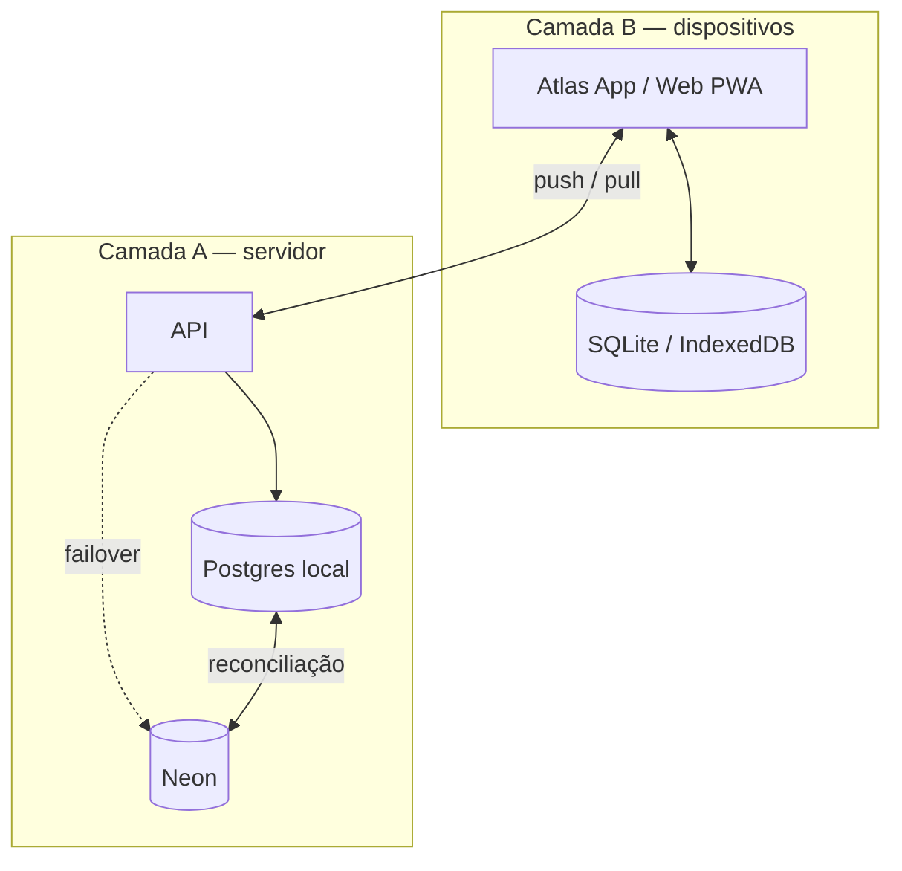
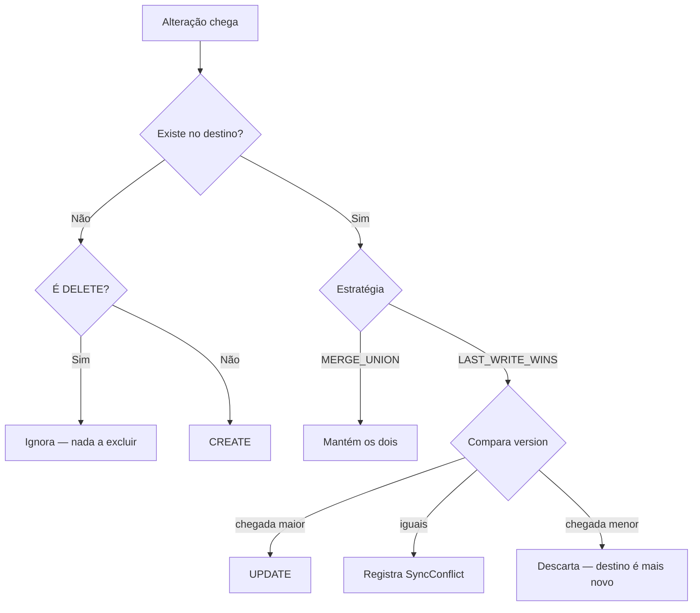

# Estratégia Offline-First e Sincronização

Este documento é o contrato da sincronização. Quem for implementar o
armazenamento offline no mobile ou no web deve segui-lo à risca.

---

## Duas camadas independentes



As camadas resolvem problemas diferentes e funcionam de forma
independente: o app sincroniza com a API sem saber qual banco está
atendendo.

---

## Campos obrigatórios em todo registro sincronizável

| Campo        | Tipo        | Papel                                                                                                |
| ------------ | ----------- | ---------------------------------------------------------------------------------------------------- |
| `id`         | `cuid`      | Gerado no **cliente**, não no servidor — o app precisa criar registros offline sem esperar resposta. |
| `version`    | `Int`       | Incrementa a cada escrita. Base do Last-Write-Wins.                                                  |
| `createdAt`  | `DateTime`  | Criação.                                                                                             |
| `updatedAt`  | `DateTime`  | Última alteração. Desempata versões iguais.                                                          |
| `deletedAt`  | `DateTime?` | **Exclusão lógica (tombstone).**                                                                     |
| `originNode` | `String`    | Quem escreveu.                                                                                       |

### Por que exclusão lógica

Um `DELETE` físico some sem deixar rastro. Na próxima sincronização, o
outro banco ainda tem o registro, não vê nenhuma alteração e o
**reenviaria** — o dado excluído reaparece. O tombstone é o que torna a
exclusão um fato propagável.

### Por que `originNode`

Sem ele: o local aplica uma alteração vinda do Neon → isso gera uma nova
entrada no outbox local → que é enviada de volta ao Neon → que a aplica e
gera outra entrada... Eco infinito. O `originNode` corta o ciclo.

---

## Camada A — failover de servidor

### Regra de roteamento

```
local acessível    → SEMPRE local          (mesmo que o Neon esteja mais rápido)
local inacessível  → Neon temporariamente
local voltou       → volta ao local + reconcilia
```

Implementado em [`DatabaseRouter`](../packages/database/src/router.ts).
Verificação a cada 15 s, com **timeout de 3 s** — sem o timeout, um banco
inacessível prenderia a requisição até o timeout de TCP do sistema
operacional.

### Reconciliação

Ao restabelecer, o motor lê as entradas `PENDING` do outbox de cada lado
e as aplica no outro, **na ordem de dependência** das entidades — um
`WorkoutDay` não pode ser inserido antes do `WorkoutPlan` que referencia.

A ordem está declarada em
[`entity-registry.ts`](../packages/database/src/sync/entity-registry.ts).

### Agendamento

| Momento                           | Origem                   |
| --------------------------------- | ------------------------ |
| 03:00 e 18:00 (America/Sao_Paulo) | `SyncScheduler` na API   |
| Quando o local volta              | Gatilho automático       |
| Manual                            | `POST /api/sync/trigger` |
| Rede de segurança externa         | Workflow do n8n          |

O fuso é fixo em `America/Sao_Paulo`: "03:00" precisa significar 3h da
manhã no Brasil, independentemente do fuso do servidor.

---

## Camada B — delta-sync dos dispositivos

### Push — dispositivo envia o que mudou

```http
POST /api/sync/push
Authorization: Bearer <token>

{
  "deviceId": "android-a1b2c3",
  "lastPulledAt": "2026-07-27T03:00:00.000Z",
  "changes": [
    {
      "entity": "HydrationLog",
      "entityId": "clx1a2b3c4d5",
      "operation": "CREATE",
      "version": 1,
      "payload": { "userId": "...", "amountMl": 250, "consumedAt": "..." },
      "occurredAt": "2026-07-27T14:32:10.000Z",
      "originNode": "android-a1b2c3"
    }
  ]
}
```

Resposta:

```json
{
  "success": true,
  "data": {
    "syncedAt": "2026-07-27T14:35:00.000Z",
    "accepted": 12,
    "rejected": [],
    "conflicts": []
  }
}
```

### Pull — dispositivo busca o que mudou

```http
POST /api/sync/pull

{
  "deviceId": "android-a1b2c3",
  "lastPulledAt": "2026-07-27T03:00:00.000Z",
  "limit": 500
}
```

`hasMore: true` significa que há mais páginas — repita com o novo cursor.
`lastPulledAt: null` faz a carga completa (primeira sincronização).

### Duas validações de segurança no servidor

O payload vem de um cliente offline e **não é confiável**:

1. **Allowlist de entidades.** Sem ela, um cliente malicioso poderia
   enviar alterações para qualquer tabela — inclusive `Role` ou
   `Permission`, escalando privilégio.
2. **Verificação de posse.** Todo registro com dono precisa pertencer ao
   usuário do token. Sem isso, bastaria trocar o `userId` no payload
   para alterar dados de outra pessoa.

Ambas em [`device-sync.service.ts`](../apps/api/src/modules/sync/device-sync.service.ts).

O servidor também descarta `id`, `version` e `originNode` enviados pelo
cliente no corpo do payload — quem define esses campos é o servidor.

---

## Resolução de conflitos

| Estratégia        | Aplicada a                             | Comportamento                                             |
| ----------------- | -------------------------------------- | --------------------------------------------------------- |
| `LAST_WRITE_WINS` | perfil, planos, avaliações             | Vence o maior `version`; empate desempata por `updatedAt` |
| `MERGE_UNION`     | hidratação, séries, peso               | Mantém os dois lados                                      |
| `MANUAL`          | versões iguais com conteúdo divergente | Vai para `SyncConflict`                                   |

### Por que hidratação usa união

Dois copos de água registrados offline em aparelhos diferentes são
**ambos verdadeiros**. Last-Write-Wins apagaria água que a pessoa
realmente bebeu. A união é possível porque cada registro tem `id`
próprio — não há o que mesclar, apenas o que somar.

### Fluxo de decisão



---

## Idempotência

Registros criados offline levam `clientGeneratedId`. Se o mesmo registro
subir duas vezes (retry, reinstalação do app, sincronização parcial), o
servidor devolve o existente em vez de duplicar.

Aplica-se a `HydrationLog` e `WorkoutLog`, via índice único
`(userId, clientGeneratedId)`.

---

## Como implementar o cliente offline

Sequência que o app deve seguir:

1. **Escrever primeiro no banco local.** A UI lê do banco local, sempre.
   Nunca espere a rede para mostrar o que o usuário acabou de registrar.
2. **Marcar como pendente.** Mantenha uma fila local de alterações não
   sincronizadas.
3. **Ao ter rede:** `push` das pendências → `pull` das novidades →
   atualizar o cursor.
4. **Tratar rejeições.** Um item em `rejected` não deve ser reenviado em
   loop — registre e mostre ao usuário se for relevante.
5. **Aplicar tombstones.** Um `DELETE` vindo do `pull` remove o registro
   local.

### Erros a evitar

| Erro                                       | Consequência                                  |
| ------------------------------------------ | --------------------------------------------- |
| Gerar `id` no servidor                     | O app não consegue criar registros offline    |
| `DELETE` físico local                      | A exclusão não se propaga                     |
| Ignorar `version`                          | Sobrescreve alterações mais novas do servidor |
| Não usar `clientGeneratedId`               | Registros duplicados após retry               |
| Guardar o cursor antes de aplicar o `pull` | Perde alterações se o app fechar no meio      |

---

## Observabilidade

| Tabela         | Conteúdo                                        |
| -------------- | ----------------------------------------------- |
| `ChangeLog`    | Outbox: toda alteração, com status e tentativas |
| `SyncRun`      | Cada execução: contadores e duração             |
| `SyncConflict` | Divergências, com os dois lados guardados       |
| `SyncCursor`   | Marca d'água por dispositivo                    |

`GET /api/sync/status` resume o estado atual — é o que o painel de
administração consome.
